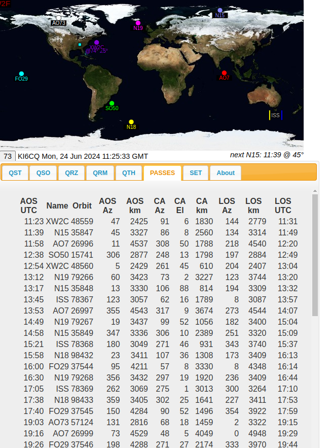

meteor-satchat
==============



Chat room app for ham radio satellite enthusiasts.

May be online intermittently [here](http://159.65.111.7:3000)

UPDATE 2024:  This is an old project from many years ago that I managed
to (barely) get running again in June 2024.  I'm really
not sure if the ham radio world really needed an internet chat room
that tracks ham radio satellites (wouldn't you rather be talking on those
than texting?).

Beta version provides basic chat room and satellite location display.

This app is written in an early version of the  [Meteor Javascript framework](http://www.meteor.com)

Contributions of code for features and patches are appreciated and will be mentioned in the CREDITS.

Satellite prediction calculations are done in the browser, based on West's PredictLib, a rewrite of KB2BD's PREDICT from C into Javascript. 

TLEs are updated automatically. The end user does not have to mess around with TLEs manually. 

Want to help out? test your own copy?

You can get it running locally with Docker using the included Dockerfile,
and it will create a website at http://localhost:3000 but only on the 
computer where it is running.  If you want to make changes, you will have
to run the `docker build` and `docker run` steps again.

```
git clone https://github.com/drpaulbrewer/meteor-satchat
cd meteor-satchat
docker build --no-cache -t satchat .
docker run -d -p 127.0.0.1:3000:3000 --restart unless-stopped satchat
# -d run in the background, not interactive
# -p address:port:port  maps address:port on host to port on container
# --restart unless-stopped  restarts the docker container if it crashes, unless manually stopped

```


Previous version 0.5.0 uses the [John Magliacane's KD2BD Predict](http://www.qsl.net/kd2bd/predict.html) binary on the back end (License: GPL).  That binary for 64 bit Ubuntu and the source tarball are also included.

Paul Brewer, KI6CQ, 20 Nov 2014
Updated to add Dockerfile, 24 Jun 2024
